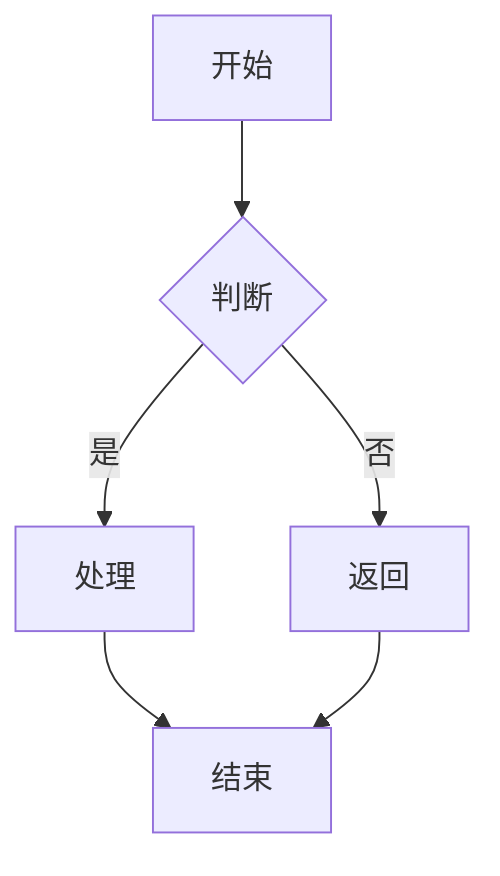
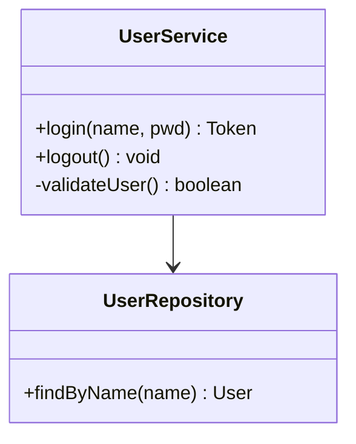
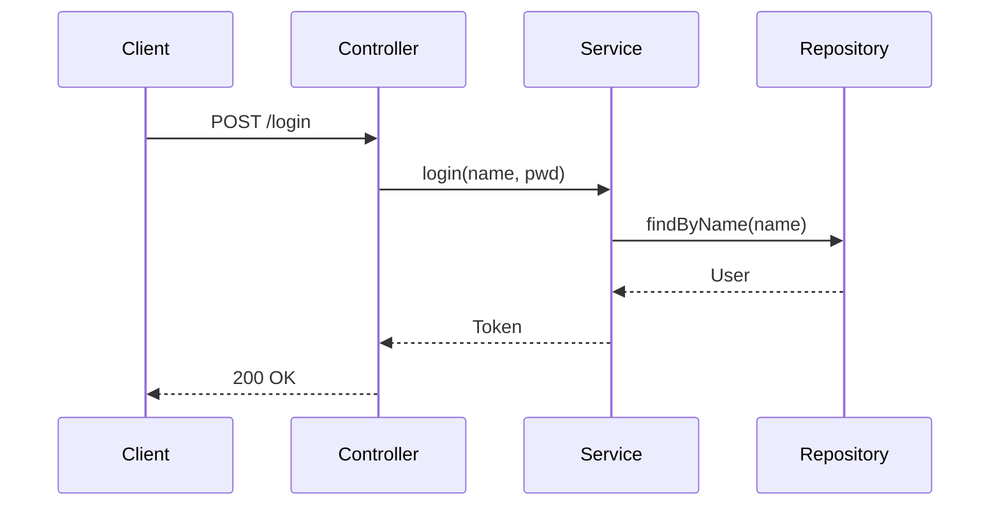
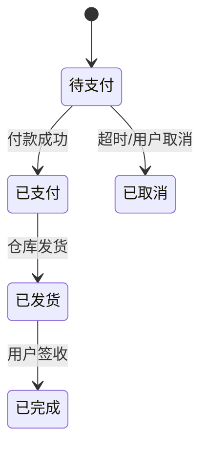
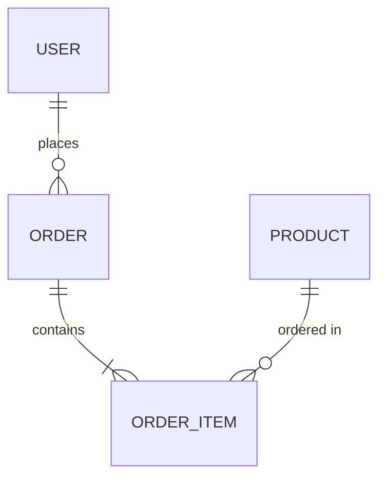

# Detail Design Skill

当用户说"生成详细设计"、"写详设"、"出设计文档"时，按此模板直接生成一份完整的设计文档。

## 输出格式

```markdown
# {功能名} — 详细设计文档

> 版本: v1.0 | 日期: YYYY-MM-DD | 作者: AI

---

## 1. 概述

### 1.1 背景
{为什么要做这个功能，解决什么问题}

### 1.2 目标
- {目标1}
- {目标2}

### 1.3 范围
- 包含: {xxx}
- 不包含: {xxx}

---

## 2. 业务流程

### 2.1 主流程


### 2.2 异常流程
{异常场景和处理方式}

---

## 3. 功能设计

### 3.1 功能列表
| 编号 | 功能 | 优先级 | 说明 |
|------|------|--------|------|
| F-01 | xxx | P0 | xxx |

### 3.2 交互说明
{页面交互、状态变化、反馈提示}

---

## 4. 技术设计

### 4.1 架构分层
```
Controller → Service → Repository → DB
```

### 4.2 核心类图


### 4.3 关键时序


### 4.4 状态机（如适用）


---

## 5. 数据设计

### 5.1 ER 关系


### 5.2 表结构
| 表名 | 说明 | 核心字段 |
|------|------|----------|
| user | 用户表 | id, username, password_hash, status |
| order | 订单表 | id, user_id, amount, status, created_at |

### 5.3 索引设计
| 表 | 索引 | 类型 | 说明 |
|----|------|------|------|
| user | idx_username | UNIQUE | 用户名唯一 |

---

## 6. 接口设计

### 6.1 接口列表
| 方法 | 路径 | 说明 | 认证 |
|------|------|------|------|
| POST | /api/login | 用户登录 | 否 |
| POST | /api/logout | 用户登出 | 是 |

### 6.2 接口详情
**POST /api/login**
- Request: `{ "username": "string", "password": "string" }`
- Response: `{ "code": 0, "data": { "token": "xxx" } }`
- 错误码: 1001=用户不存在, 1002=密码错误, 1003=账号锁定

---

## 7. 安全设计

| 措施 | 说明 |
|------|------|
| 密码加密 | bcrypt, cost=12 |
| Token 管理 | JWT, 有效期 2h, Refresh Token 7d |
| 登录限制 | 5 次失败锁定 30 分钟 |
| SQL 注入 | MyBatis 参数化查询 |
| XSS | 输出转义 + CSP 头 |
| CSRF | SameSite Cookie + Token |

---

## 8. 异常处理

| 场景 | 错误码 | HTTP 状态 | 用户提示 |
|------|--------|-----------|----------|
| 用户名不存在 | 1001 | 401 | 用户名或密码错误 |
| 密码错误 | 1002 | 401 | 用户名或密码错误 |
| 账号锁定 | 1003 | 423 | 账号已锁定，请 30 分钟后重试 |
| 参数校验失败 | 1004 | 400 | 请输入正确的用户名和密码 |
| 系统异常 | 9999 | 500 | 系统繁忙，请稍后再试 |

---

## 9. 测试要点

### 9.1 功能测试
- [ ] 正常登录流程
- [ ] 错误密码提示
- [ ] 锁定机制触发与恢复
- [ ] Token 过期处理

### 9.2 性能测试
- 并发登录 QPS ≥ 1000
- 登录响应 P99 < 500ms

---

## 10. 风险与应对

| 风险 | 概率 | 影响 | 应对 |
|------|------|------|------|
| 暴力破解 | 高 | 高 | 锁定机制 + 验证码 |
| Token 泄露 | 中 | 高 | 短有效期 + HTTPS |
| 并发登录瓶颈 | 低 | 中 | Redis 缓存 Session |
```

## 使用方式

AI 根据当前功能上下文自动填充各章节。用户说：

- "给登录功能出个详设" → 基于上下文填充
- "这个接口的设计文档写一下" → 重点填充接口设计章节
- "数据表结构帮我整理成详设格式" → 重点填充数据设计章节

无上下文的章节保留模板占位符，标注 `{待补充}`。
