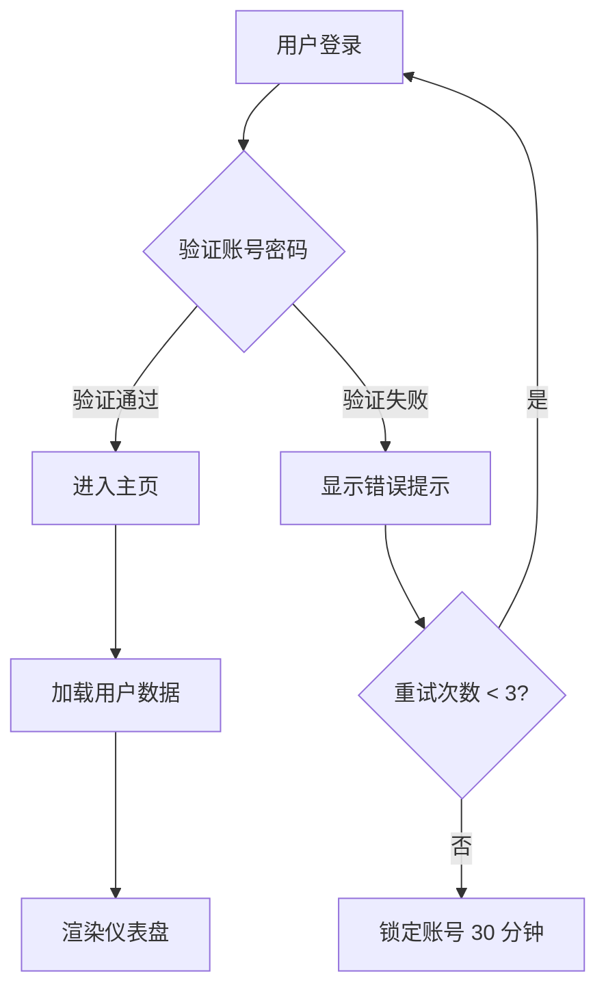
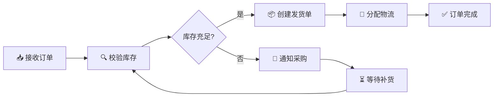
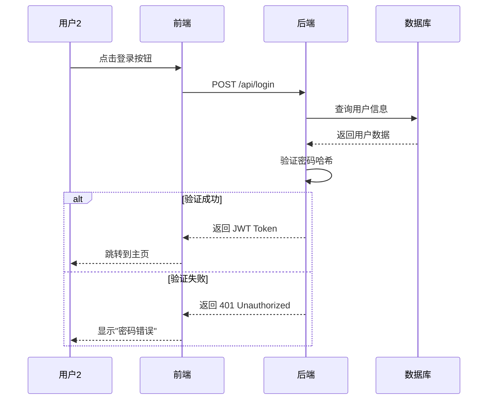
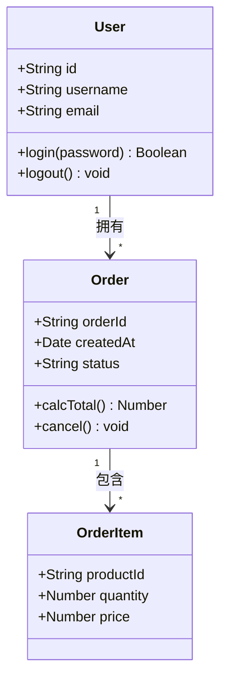
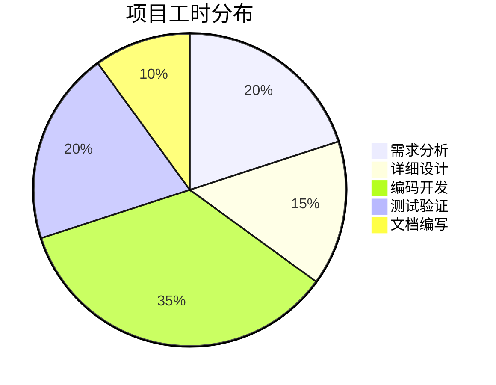
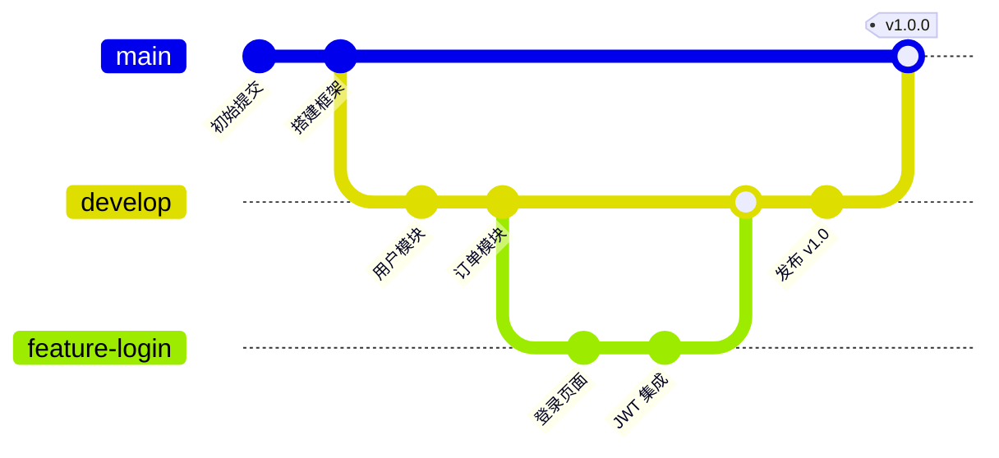
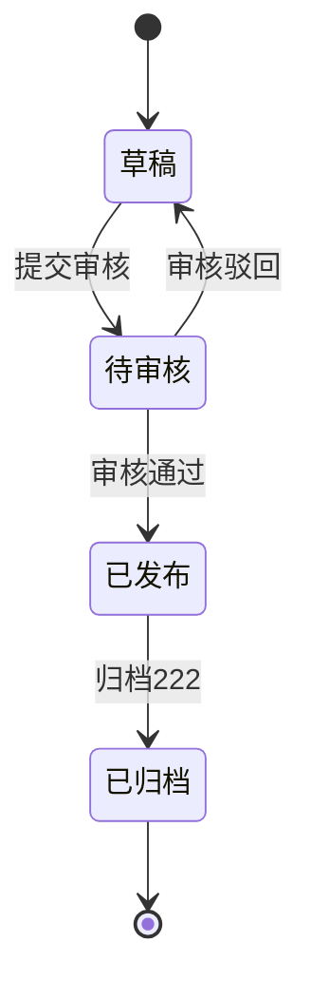

# Mermaid 流程图测试文档

本文件用于测试 DocBrowser 的 Mermaid 渲染效果。

---

## 1. 自上而下流程图 (flowchart TD)

---

## 2. 自左而右流程图 (flowchart LR)

---

## 3. 时序图 (sequenceDiagram)

---

## 4. 类图 (classDiagram)

---

## 5. 饼图 (pie)

---

## 6. Git 分支图 (gitGraph)

---

## 7. 状态图 (stateDiagram)

---

> ✅ 如果上面所有图表都能正常显示为图形，说明 Mermaid 渲染工作正常。
